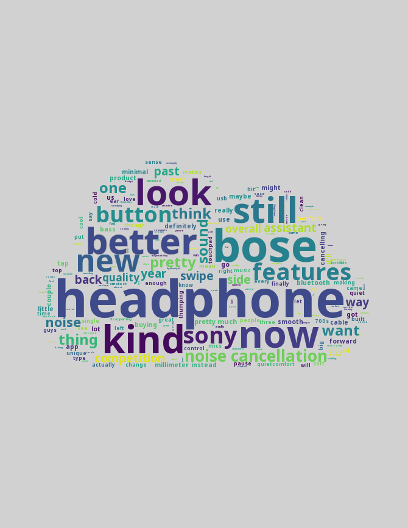

<p align="center">
    
    <h1 align="center">VideoCloud</h1>
    <p align="center">
      <a href="https://travis-ci.org/paramt/videocloud"></a>
      <a href="https://pypi.org/project/VideoCloud"></a>
      <a href="LICENSE"></a>
      <a href="https://www.codefactor.io/repository/github/paramt/videocloud"></a>
      <br>
      <a href="https://requires.io/github/paramt/videocloud/requirements/?branch=master"></a>
      <a href="https://github.com/paramt/videocloud/commits/"></a>
    </p>
    <h4 align="center">Generate word clouds from YouTube videos</h4>
</p>

## Installation

```
pip install videocloud
```

*Note: A C compiler is required for the installation process.*

## Usage

```
videocloud <link to YouTube video> [options]
```

```
videocloud www.youtu.be/MHTizZ_XcUM --language=es --color=#eee
```

### Options

#### `--filepath`
Where on disk to save the generated videocloud

Default: <kbd>videocloud.png</kbd>

#### `--language`
2-letter language code of the captions

Default: <kbd>en</kbd>

#### `--color`
Hex color code of the videocloud's background color

Default: <kbd>#d1d1d1</kbd>

#### `--font`
Link to a TTF font file

Default: [Noto Sans](assets/fonts/NotoSans/NotoSans.ttf)

#### `--mask`
Link to a PNG mask file

Default: [Cloud](https://github.com/paramt/videocloud/blob/v2.5/assets/masks/cloud.png)

## Examples

These are a few examples of wordclouds generated by videocloud. The entire list of examples can be found under [/assets/examples](assets/examples).

 

## License

All the code in this repo is licensed under the [MIT License](LICENSE) unless otherwise specified. You are free to use, modify, and distribute the source code as long as you include the original license file. [Some fonts](assets/fonts) are licensed separately under the [SIL Open Font License](https://github.com/paramt/videocloud/blob/master/assets/fonts/NotoSans/SIL%20Open%20Font%20License.txt).
